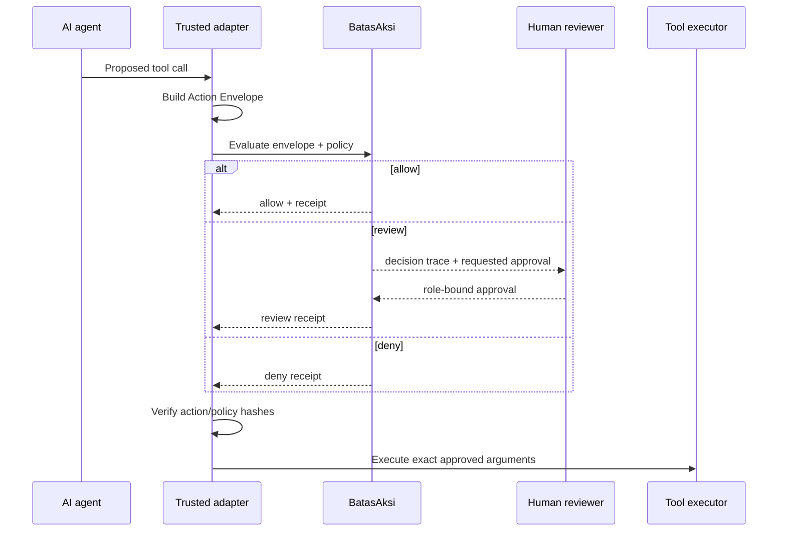

# Integration guide

Place BatasAksi immediately before the component that can create a side effect.



## TypeScript

```ts
import { createReceipt, evaluateAction } from "@batasaksi/core";

const result = evaluateAction(actionEnvelope, teamPolicy);

if (result.decision === "deny") {
  throw new Error(result.reasons.join("; "));
}

if (result.decision === "review") {
  // Obtain approvals through your identity-aware review system.
}

const receipt = await createReceipt({
  action: actionEnvelope,
  policy: teamPolicy,
  approvals,
});
```

## CI preflight

Use simulation to ensure a proposed action is allowed:

```bash
batasaksi simulate action.json policy.json --fail-on review
```

Exit codes are `0` for success, `1` for invalid usage/input, `2` for a decision
at the requested fail threshold, `3` for an invalid receipt, and `4` for a
policy diff that weakens controls.

## Adapter checklist

1. Derive the envelope from typed tool arguments outside the model.
2. Keep the policy read-only for the agent identity.
3. Treat an unknown or invalid envelope as deny.
4. Bind approver identities through your existing authentication system.
5. Verify hashes directly before executing the original arguments.
6. Store receipts in append-only or separately controlled storage.
